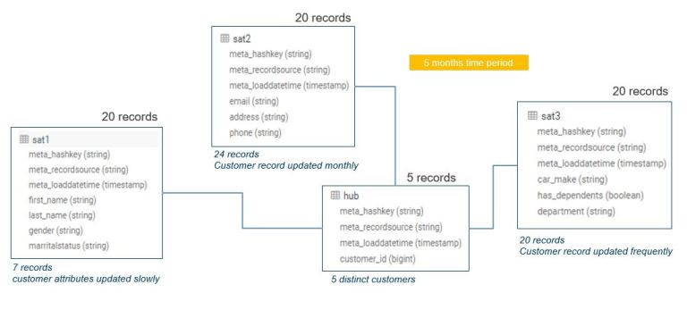

# example_dv_hadoop_pit_table
Some sample files and code demonstrating how to create virtual pit tables in hadoop for data vault when using an insert only architecture

Please note that the script are apache impala native scripts

Here is a brief diagram of the vault model the data represents:

